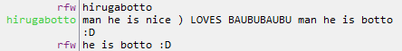

#BotBot

One bot to rule them all...

Please note: RubyBot is now deprecated. Please upgrade to BotBot :^)



##What is BotBot?
BotBot is the 3rd generation of IRC bots I've written. He is a general utility/humor
bot for use in any IRC channel. He is currently running on Rizon. He is mainly a tool
for me to learn and try out new things in Ruby when I don't have a specific project in
mind. He uses a lot of neat things like metaprogramming, dynamic creation of functions,
and more!

##Running locally

BotBot can be run from localhost. Simple clone the repo, edit the ```$bot``` params
(this will eventually be a config file...). Provide him with an irc server address,
port number (typically 6667, no SSL support yet!), a channel name and a nickname.
Start him up in your terminal via `ruby BotBot.rb` and he will join your channel!

##Deploying on Heroku

BotBot can also be run on a Heroku Cedar stack instance - even a free one! To do this,
clone the repo and copy the instructions above. Instead of running the ruby script
in your local terminal, create a Heroku project, ```git add```, ```git commit``` and 
```git push``` BotBot to your remote Heroku repo. Then in your terminal issue
```heroku  ps:scale bot=1``` to spin up a dyno for BotBot (his Procfile is already
properly configured for this). He should join your channel soon after. If you run into
problems, run ```heroku logs``` or try to deploy locally and debug.

Running on Heroku allows you to test new features locally in dev and then ```git push``` 
to Heroku once you have finished your feature. Heroku will automagically terminate the
current instance of BotBot, fetch the new repo and updated code and re-launch him - you
don't have to do anything!